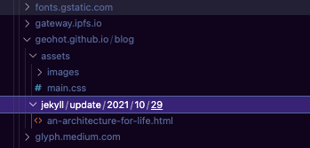

archiver
========

Archive websites using Dappnet.

How does this work?

 * Run a local Electron process.
 * Visit a site.
 * Intercept all HTTP requests and log + save them to disk.
 * Replay HTTP requests for a cacheable website.

